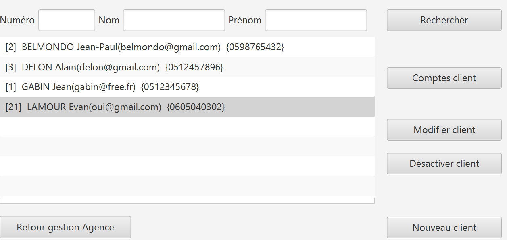
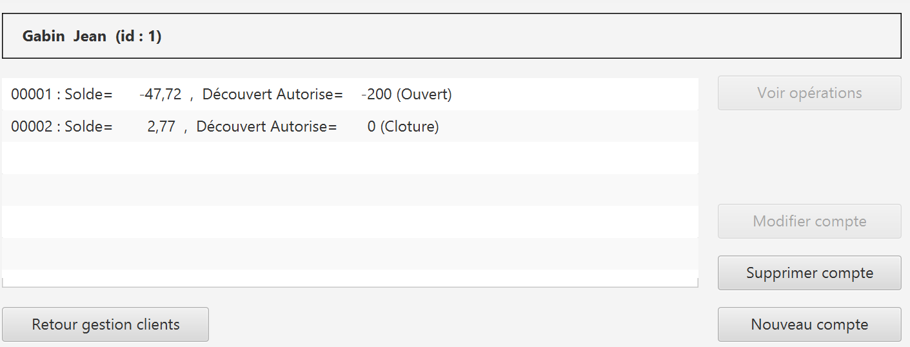

= Documentation utilisateur - BankUtil - Version 1
=
:toc-title: Sommaire
:toc: auto
:toclevels: 3

*Date :* 16/05/2023 +
*Par :* Équipe 4A3 : _DIDENKO Andrii, LAMOUR Evan, KRILL Maxence, SHULHINA Daria_

== I. Présentation

Bienvenue dans le guide utilisateur de l'application BankUtil à destination des employés de DailyBank.

Ce guide vous servira à connaître dans les détails les différentes fonctionna=

== II. Usages

=== Connexion

Lors de l'ouverture de l'application, vous tomberez sur cette interface :

image::../img/userDoc/start.png["Page de connexion"]

Appuyez sur le bouton ``Connexion`` ou sur ``Utilisateur > Connexion`` pour vous connecter à votre compte.

Renseignez ici votre identifiant et votre mot de passe pour accéder à votre compte :

image::../img/userDoc/login.png["Identifiant et mot de passe"]

=== Page d'accueil

Une fois connecté, vous arriverez sur cette fenêtre. Vous verrez les informations de votre agence, ainsi que les informations de l'utilisateur connecté.

image::../img/userDoc/accueil.png["Page d'accueil"]

=== Déconnexion

Depuis la page d'accueil, appuyez sur ``Deconnexion``, sinon, appuyez sur ``Deconnexion`` depuis le menu ``Utilisateur``.

=== Gérer les clients

Dans le menu, cliquez sur ``Gestion > Clients``.

Une fenêtre va s'ouvrir :

Sur cette fenêtre, renseignez le Numéro du client cherché, son nom ou son prénom puis cliquez sur ``Rechercher``,
Si vous souhaiter afficher tout les clients, ne renseignez aucun champ et appuyez directement sur ``Rechercher``.

==== Créer un client

Depuis l'écran de gestion de clients, cliquez sur ``Nouveau client``.

image::../img/userDoc/creerClient.png["Page de gestion client"]

Vous pouvez ici créer un nouveau client en saisissant ces données.

Cliquez sur ``Modifier`` pour valider ou sur ``Annuler`` pour revenir en arrière.

==== Modifier un client

Depuis l'écran de gestion de clients, cliquez sur ``Modifier client``.

image::../img/userDoc/modifierClient.png["Page de modification client"]

Vous pouvez ici changer les données d’un client. +
A noter que seul un chef d’agence peut modifier l’activité du client.

Cliquez sur ``Modifier`` pour valider ou sur ``Annuler`` pour revenir en arrière.

==== Rendre "inactif" un client

Pour rendre "inactif" un client, assurez vous d'être connecté en tant que chef d’agence.

image::../img/userDoc/inactifClient.png["Page de suppresion client"]

Sélectionnez un client (assurez vous qu'il soit affiché en gris) puis cliquez  sur ``Désactiver client``.

=== Gérer comptes bancaires

Depuis l'écran de gestion client, cliquez sur ``Comptes clients``.

Vous arrivez sur cet écran

==== Nouveau compte

Depuis l'écran précédent, cliquez sur ``Nouveau compte``.

image::../img/userDoc/nouveauCompte.png["Page de création de compte"]

Renseignez les informations du compte, puis cliquez sur ``Ajouter`` ou ``Annuler``.

==== Clotûrer compte

Sélectionnez un compte puis cliquez sur ``Supprimer`` pour clôturer le compte.

image::../img/userDoc/cloturerCompte.png["Erreur suppression compte"]

*A noter que le solde du compte doit être égal à 0*

=== Gérer les opérations

Depuis la page de gestion des comptes, sélectionnez un compte et cliquez sur ``Voir opérations``.

image::../img/userDoc/gererOperation.png["Gestion des opérations"]

A noter que l'interface de crédit et débit ont la même interface graphique. De ce fait, les procédures pour les deux opérations sont identiques.

==== Enregistrer opération

Vous avez la possibilité de choisir le type d'opération (crédit/débit) et d'indiquer le montant.

image::../img/userDoc/enregistrerOperation.png["Page d'enregistrement de débit/crédit"]

Une fois fait, cliquez sur ``Effectuer débit/crédit`` ou ``Annuler débit/crédit``.

==== Enregistrer virement

Dans l’onglet prélèvement, indiquez le numéro de compte destinataire ainsi que le montant de la transaction.

image::../img/userDoc/enregistrerVirement.png["Page de virement"]

=== Gérer les employés

De la même manière que l’onglet de gestion des clients, vous pouvez gérer les employés en tant que chef d'agence.

image::../img/userDoc/gererEmploye.png["Page de gestion des employés"]
