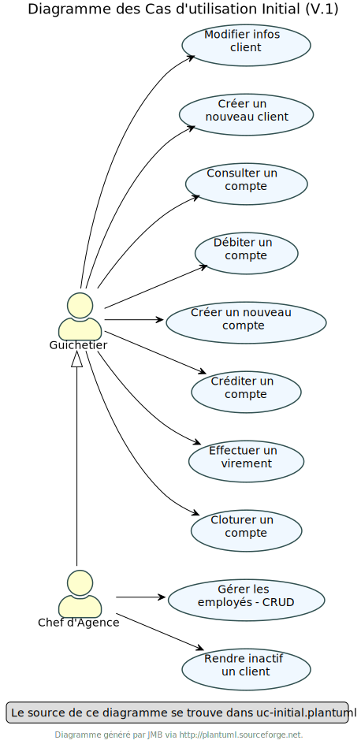
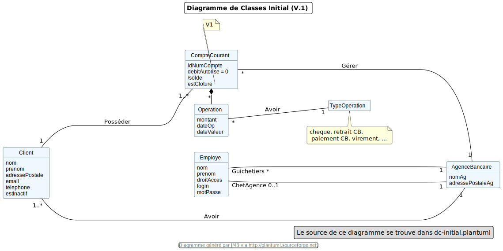
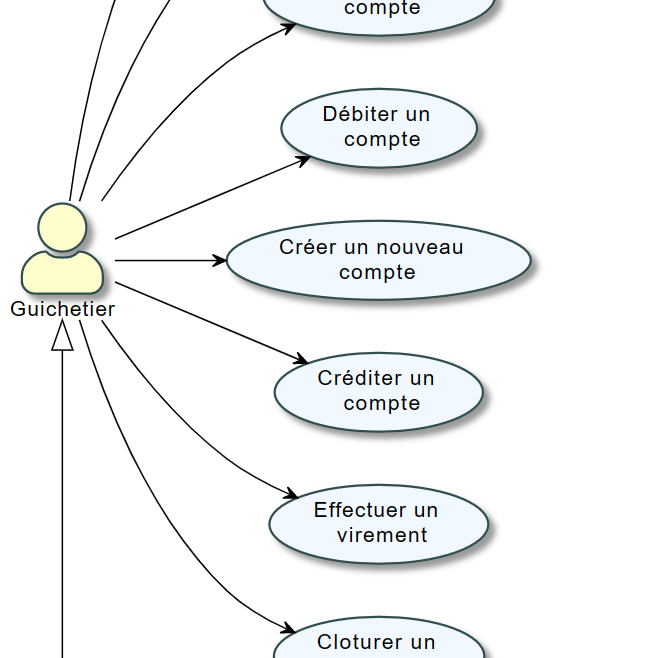
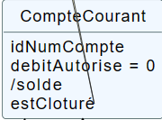
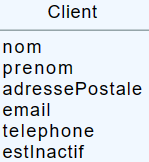
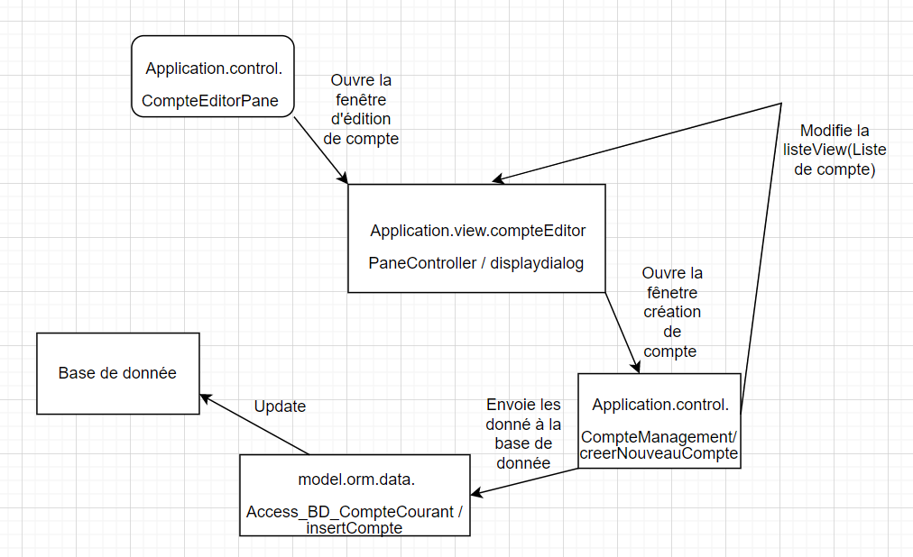

= Documentation technique - BankUtil - Version 1
:toc:
:toc-title: Sommaire

:Entreprise: DailyBank
:Equipe: 4A03

*Date :* 17/05/2023 +
*Par :* Équipe 4A3 : _DIDENKO Andrii, LAMOUR Evan, KRILL Maxence, SHULHINA Daria_ler chaques fonctionnalités de la V1 de l'application DailyBank

== I. Présentation de l'application

L’application Daily Bank est l’outil de gestion de la banque . Nous allons adapter cette application aux besoin de la banque pour developper les versions suivantes.

=== 1. Cas d'utilisation global

La V1 de l'application va permettre au *guichetier* de réaliser de nouvelles actions tel que :

* Créer un compte
* Créditer un compte
* Effectuer un virement de compte à compte
* Clôturer un compte

Le *Chef d'Agence* aura la possibilité de réaliser toutes les actions d'un guichetier et aura désormais la possibilité de gérer les employés et les autres chefs d'agence *(CRUD)*.

=== 2. Diagramme de classe

Voici le diagramme de classe de la base de données de la banque DailyBank

* *AgenceBancaire* : represente une agence constitué du nom de l'agence, de son adresse, d'un id et d'un chef d'agence représenté par une ID.
* *Employé* : représente les employés de la banque, qui ont des login et des droits d'accès différents selon si ils sont chef d'agence ou pas .
* *Client* : représente le client avec toutes ses information personnelles ainsi que son agence et son statut (*Actif* ou *Innactif*) .
* *CompteCourant* : représente les comptes avec le numéro du compte, le debit autorisé, la solde, le numéro du client auquel appartient le compte , et son statut ( cloturé ou pas)
* *Operation*: représente une operation opéré sur un compte, on y retrouve l'id de celle ci, le montant, la date , le numero du compte ainsi que le type d'opération.
* *TypeOperation* liste les type d'OPERATION (Credit, Debit, Virement)

== II. Architecture de l'application

=== 1. Structuration des packages

Les packages : dans src/main/java

*** application

  ** DailyBank : main() de départ

*** application.control

  ** Contrôleurs de dialogue et accès aux données : gestion des fonctions de l’application. Deux rôles majeurs :

    * Réalise les actions concrètes : accès BD, faire un calcul complexe, générer un fichier, …

    * Ouvre les autres fenêtres nécessaires : gestion du dialogue.

*** application.view

   ** Contrôleurs associés aux vues fxml.

    * Gestion de la vue affichée : contrôle des saisies réalisées, messages d’erreurs pour les contrôles de surface, appel du contrôleur de dialogue pour réaliser les actions concrètes.

*** application.tools

  ** Utilitaires pour application.view et application.control

*** model.data

  ** Classes java mappant les table de la BD. Une table ⇒ 1 classe. On peut en ajouter (classes pour jointures, …)

*** model.orm

  ** Classes d’accès physiques à la BD. Une table ⇒ 1 classe offrant différentes méthodes pour accéder à la table : select, insert, delete, update, appel de procédure stockée (elles sont données). On peut en ajouter.

*** model.exception

  ** Classes des exceptions spécifiques d’accès à la BD, levées par les classes de model.orm

Les views fxml : dans src/main/resources.

*** application.view

  ** Vues de l’application : fichiers fxml

  ** Fichier css

=== 2. Rôle de chaque classes dans les packages

*** application

** DailyBank : main() de l’application, permet de lancer l'application ( "runapp()" ).

** DailyBankState : classe de description du contexte courant de l’application : qui est connecté ? est-il chef d’agence ? à quelle agence bancaire appartient-il ?

*** application.control

** Une classe par fenêtre dite contrôleur de dialogue. Exemple LoginDialog

** Rôles de chaque classe :

* A la création : i) construit le Stage java FX de la fenêtre, ii) charge le fichier fxml de la vue et son contrôleur

* Offre une méthode de démarrage du Dialogue, du type doNomClasseControlDialog(...). Exemple doLoginDialog()

* Offre des méthodes d’accès aux données, disponibles pour son contrôleur de vue

* Offre des méthodes d’activation d’autres fenêtres, disponibles pour son contrôleur de vue

* Peut offrir des méthodes de calcul ou autre (accès à des fichiers, …), disponibles pour son contrôleur de vue

*** application.view

** Une classe par fenêtre dite contrôleur de vue ET un fichier fxml associé. Exemple LoginDialogController et logindialog.fxml

** Un objet d’une telle classe ne connaît de l’application que son contrôleur de dialogue (de application.control)

** Rôles de chaque classe :

* Offre une méthode initContext(...) pour être initialisée. Appelée par le contrôleur de dialogue

* Offre une méthode displayDialog(...) pour afficher la fenêtre. Appelée par le contrôleur de dialogue

* Gère toutes les réactions aux interactions : saisies, boutons, …

* Met à jour l’interface lorsque de besoin : griser des boutons, remplir des champs, …

* Effectue tous les contrôles de surface au niveau de la saisie : valeurs remplies, nombres < 0, …

* Appelle son contrôleur de vue si besoin d’accéder à des données

* Appelle son contrôleur de vue si besoin de lancer une autre fonction (fenêtre) de l’application

*** model.data

** Classes java mappant les table de la BD.

* Une table ⇒ 1 classe. On peut en ajouter (classes pour jointures, …)

** Servent à échanger les donnes entre model.orm et application.control

** Ces classes ne définissent aucune méthode qui "fait quelque chose" (calcul, …). Les attributs sont public et une seule méthode toString (). Chaque attribut est un champ de la table.

** Ces classes ne contiennent que les champs de la BD que l’on souhaite remonter vers l’application.

*** model.orm

** Classes d’accès physiques à la BD.

** Une table ⇒ 1 classe offrant différentes méthodes pour accéder à la table : select, insert, delete, update, appel de procédure stockée (elles sont données). On peut en ajouter.

** Chaque classe : effectue une requête SQL, presque la requête qu’on ferait au clavier envoyée au serveur sous forme de String. Ensuite elle emballe le résultat en java (objets de model.data, ArrayList, …).

A part :

** model.exception : pour ne pas mélanger classes de code et classes d’exception

* A voir sur le code lorsque de besoin.

** application.tools : pour isoler des classes utilisées à plusieurs endroits et qui sont utilitaires par rapport aux objectifs de l’application.

*  A voir sur le code lorsque de besoin

== III. Fonctionnalités de l'application

=== 1. Créer compte Evan

==== A. Use Case

Création de la fonctionnalité créer compte pour les guichetier et les chefs d’agence

==== B. Diagramme de classe

Les deux classe utilisé dans la base de donnée sont Client et CompteCourant , Client est utilisé en tant que lecture, CompteCourant est modifié.

==== C. Classes impliquées Créer compte

* Application.control.CompteEditorPane : Génère la page de d’édition d’un compte ou l’on peut choisir entre effectuer opération, ajouter compte ou supprimer compte

* Application.view.compteEditorPaneController / displaydialog : Créer la fenêtre en fonction du mode choisis ici Création nous intéresse

* model.orm.data.Access_BD_CompteCourant / insertCompte : cette fonction se connecte à la base de donnée et modifie la base de donnée avec le compte quelle reçoit en paramètre

* Application.control.CompteManagement/ creerNouveauCompte : Créer un nouveau compte avec des paramètre entrée et modifie la list view pour qu’il soit visible dans la liste de compte, puis elle envoie ceci à l’acces_BD pour modifier les donnée cette fois ci dans la base de donnée

