= Documentation utilisateur - BankUtil - Version 2
:toc-title: Sommaire
:toc: auto
:toclevels: 3

*Date :* 16/05/2023 +
*Par :* Équipe 4A3 : _DIDENKO Andrii, LAMOUR Evan, KRILL Maxence, SHULHINA Daria_

== I. Présentation

Bienvenue dans le guide utilisateur de l'application `BankUtil` à destination des employés de DailyBank.

Cette application est dediée aux guichetiers et aux chefs d'agence de l'entreprise. Elle permettra de gérer *les employés, les clients, et leurs comptes*, effectuer differentes *opérations*, la gestion des *prélèvements* ainsi que des *simulations d'emprunts*.

Ce guide vous servira à connaître dans les détails les différentes fonctions de l'application, et comment y accéder.

== II. Installation

Pour lancer l'application veuillez cliquer sur ce lien : https://github.com/IUT-Blagnac/sae2023-bank-4a3/releases/tag/v2

Téléchargez ensuite le fichier `4A3-BankUtil.jar` et lancez le.

== III. Usages

===  1. Connexion | V0

Lors de l'ouverture de l'application, vous tomberez sur cette interface :

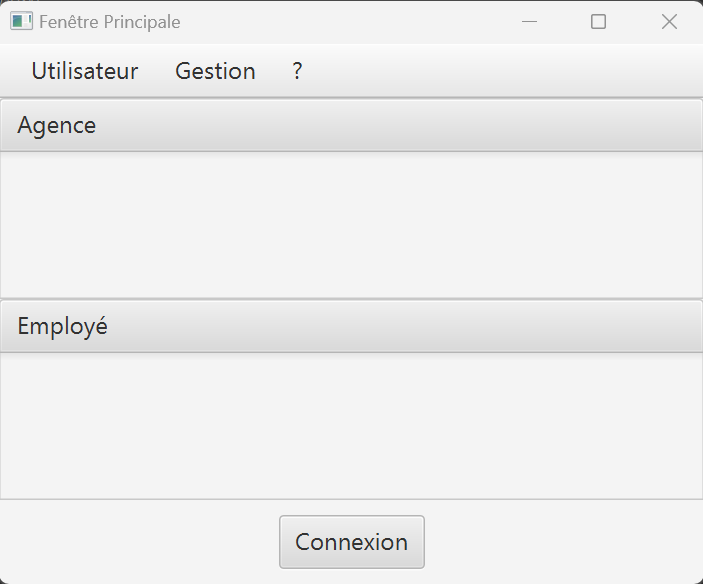

Appuyez sur le bouton `Connexion` ou sur `Utilisateur` > `Connexion` pour vous connecter à votre compte.

Renseignez ici votre identifiant et votre mot de passe pour accéder à votre compte.

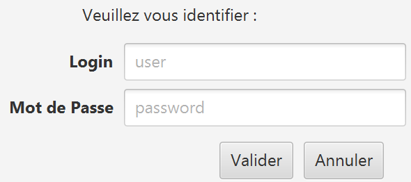

=== 2. Page d'accueil | V0

Une fois connecté, vous arriverez sur cette fenêtre. Vous verrez les informations de votre agence, ainsi que les informations de l'utilisateur connecté.

C'est d'ici que vous pourrez accéder aux différentes fonctionnalités de l'application.

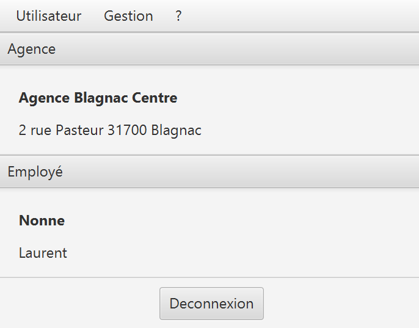

=== 3. Déconnexion | V0

Depuis la page d'accueil, appuyez sur `Deconnexion`, sinon, appuyez sur `Deconnexion` depuis le menu `Utilisateur`.

=== 4. Gérer les clients | V0

Dans le menu, cliquez sur `Gestion` > `Clients`.

Une fenêtre va s'ouvrir avec les clients présents dans votre agence :

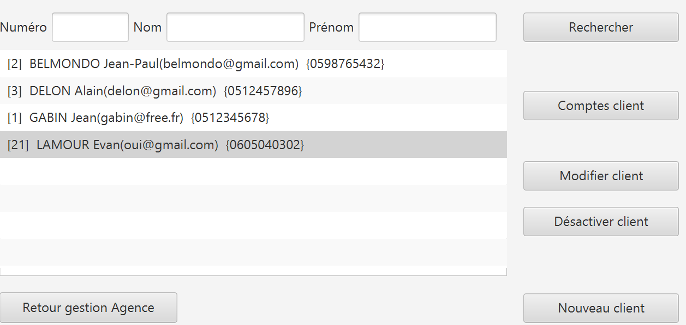

Sur cette fenêtre, renseignez le numéro du client cherché, son nom ou son prénom puis cliquez sur `Rechercher`. +
Si vous souhaiter afficher tout les clients, ne renseignez aucun champ et appuyez directement sur `Rechercher`.

==== a. Créer un client | V0

Depuis l'écran de gestion de clients, cliquez sur `Nouveau client`.

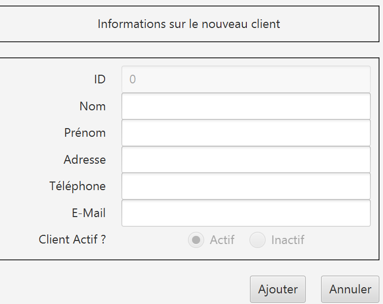

Vous pouvez ici créer un nouveau client en saisissant ces données.

Cliquez sur `Modifier` pour valider ou sur `Annuler` pour revenir en arrière.

==== b. Modifier un client | V0

Depuis l'écran de gestion de clients, sélectionnez le client voulu puis cliquez sur `Modifier client`.

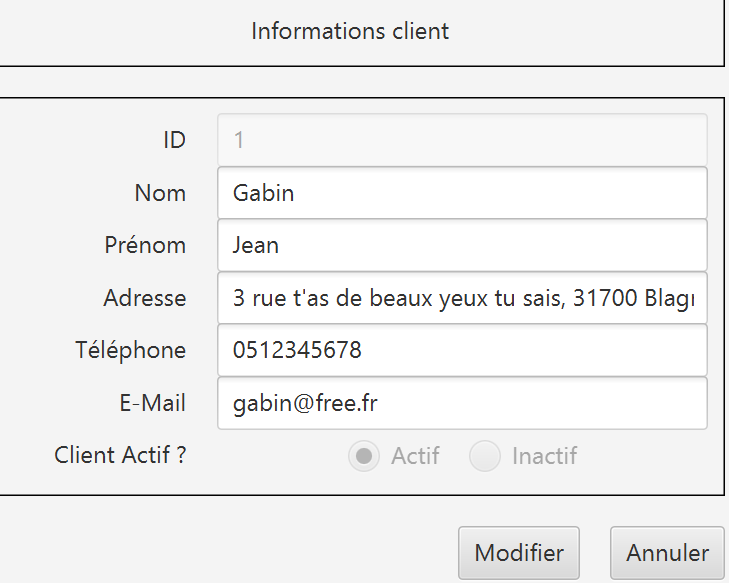

Vous pouvez ici changer les données d’un client.

Cliquez sur `Modifier` pour valider ou sur `Annuler` pour revenir en arrière.

==== c. Rendre "inactif" un client | V0

Pour rendre "inactif" un client, assurez vous d'être connecté en tant que chef d’agence.

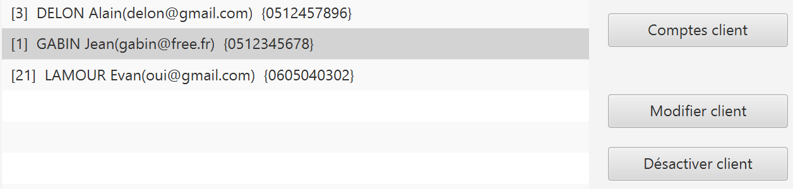

Sélectionnez un client (assurez vous qu'il soit affiché en gris) puis cliquez sur `Désactiver client`. +
*A noter que les comptes du client doit tous être clôturés* (voir `5. Gérer les comptes bancaires` > `c. Clotûrer un compte - Evan`).

=== 5. Gérer les comptes bancaires

Depuis l'écran de gestion des clients, cliquez sur `Comptes client`.

Vous arriverez sur cet écran :

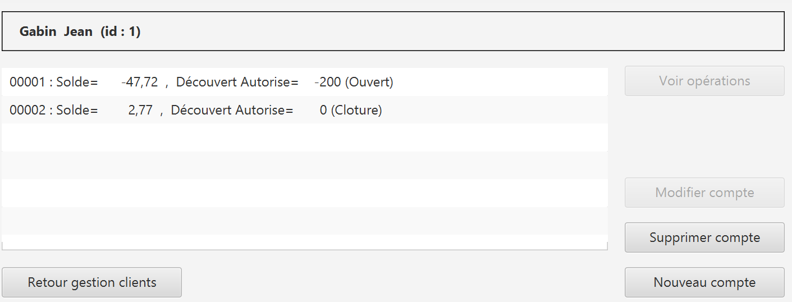

==== a. Nouveau compte | Evan

Depuis l'écran de gestion des comptes bancaires, cliquez sur `Nouveau compte`.

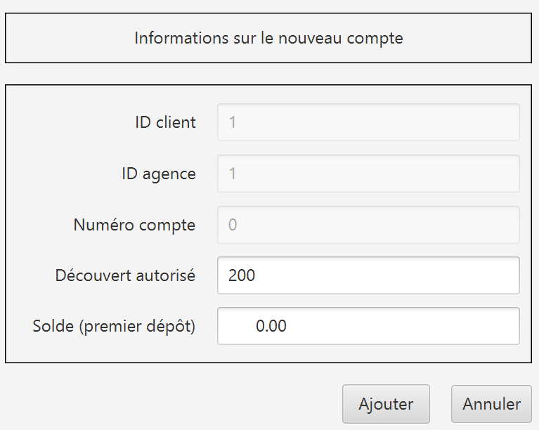

Renseignez les informations du compte, puis cliquez sur `Ajouter` ou `Annuler`. +
*A notre que le client doit être actif pour créer un nouveau compte.*

==== b. Modifier un compte | Maxence

==== c. Clotûrer compte | Evan

Sélectionnez un compte puis cliquez sur `Supprimer` pour clôturer le compte.

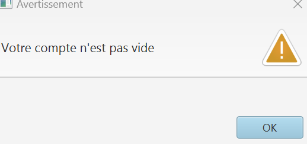

*A noter que le solde du compte doit être égal à 0 €.*

=== 6. Gérer les opérations

Depuis la page de gestion des comptes, sélectionnez un compte et cliquez sur `Voir opérations`.

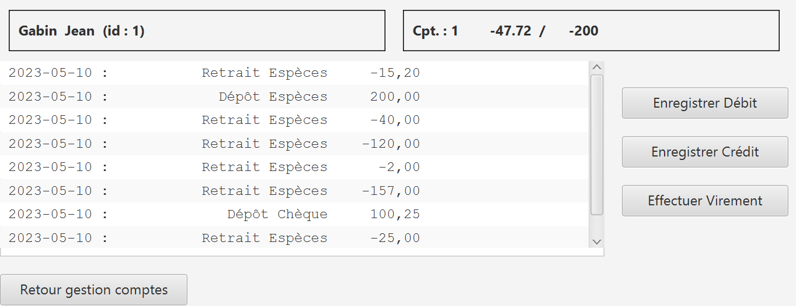

A noter que l'interface de crédit et débit ont la même interface graphique. De ce fait, les procédures pour les deux opérations sont identiques.

==== a. Enregistrer opération | Evan

Vous avez la possibilité de choisir le type d'opération (crédit/débit) et d'indiquer le montant.

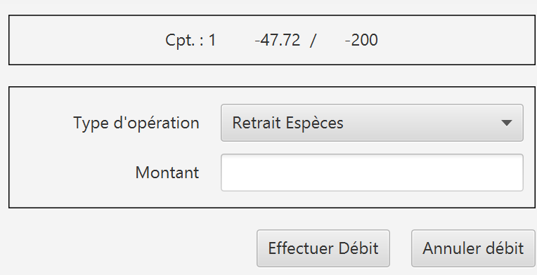

Une fois fait, cliquez sur `Effectuer débit/crédit` ou `Annuler débit/crédit`.

==== b. Enregistrer virement | Evan

Dans l’onglet prélèvement, indiquez le numéro de compte destinataire ainsi que le montant de la transaction.

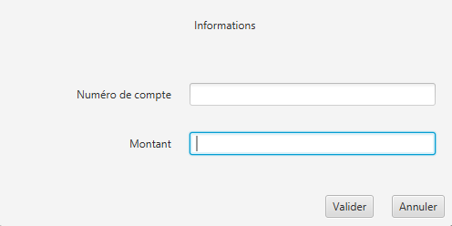

==== c. Relevé PDF | Andrii et Daria

Depuis la page de gestion des opérations, cliquez sur `Générer relevé PDF`. +
Un relevé PDF pour le compte sélectionné sera généré dans le répertoire où se trouve l'exécutable de l'application et s'ouvrira automatiquement.

=== 7. Gérer les employés | Maxence

De la même manière que l’onglet de gestion des clients, vous pouvez gérer les employés en tant que chef d'agence.

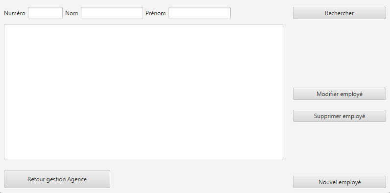

=== 8. Gérer les prélèments | Evan et Maxence

De la même manière que l’onglet de gestion des clients, vous pouvez gérer les prélèvements en tant que guichetier ou chef d'agence.

image::["Page de gestion des prélèvements"]

=== 9. Simuler un emprunt (Assurance) | Evan

Assurez-vous d'être connecté en tant que chef d'agence.

Dans le menu, cliquez sur `Simulation` > `Emprunt`.

Une fenêtre va s'ouvrir :

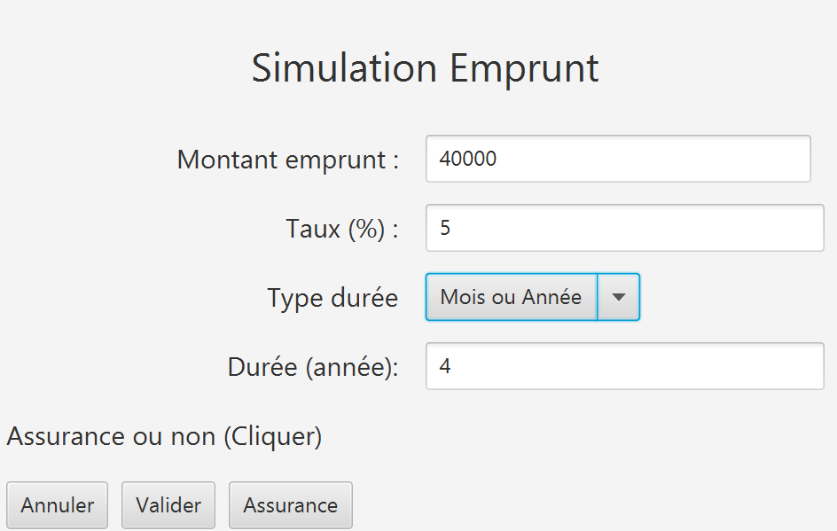

Renseignez les champs requis, puis cliquez sur `Valider` ou `Annuler`. +
A noter que le taux choisis est annuel.

Après avoir remplis les champs tel qu'indiqué, cliquez sur `Valider` et vous verrez le tableau d'amortissement.

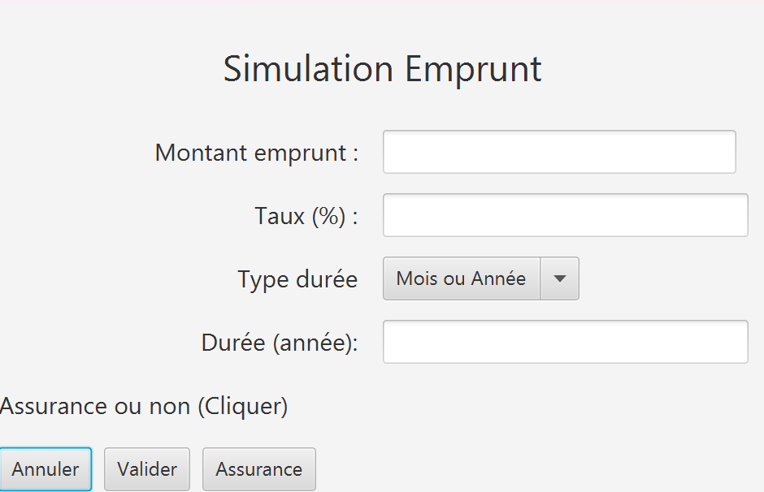

Pour un taux d'assurance cliquer sur le bouton `Assurance` et rentrez votre taux dans la zone de texte.

Vous voulez ne plus avoir d'assurance, pas de problème recliquer sur le bouton `Assurance`. Le champ disparaîtra.

=== 10. Contact 

Si vous rencontrez des problèmes avec l'application, veuillez le signaler à notre adresse mail assistance : assistance@adem.com