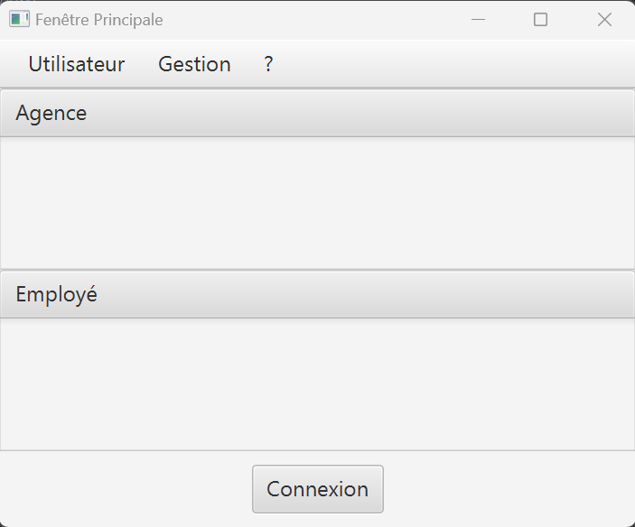
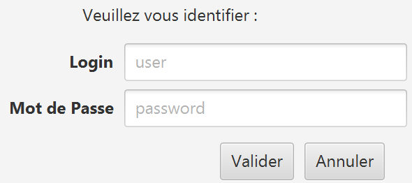
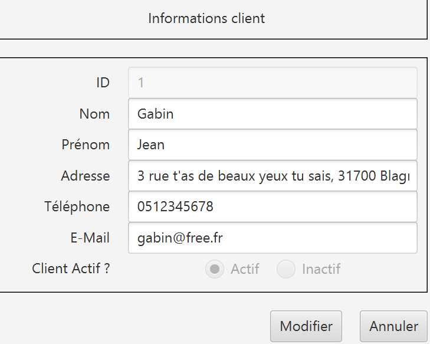
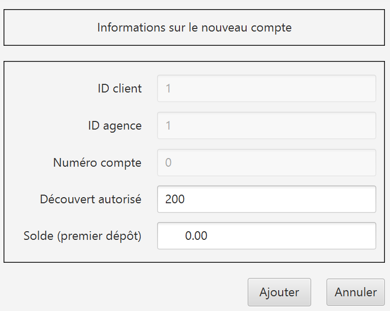
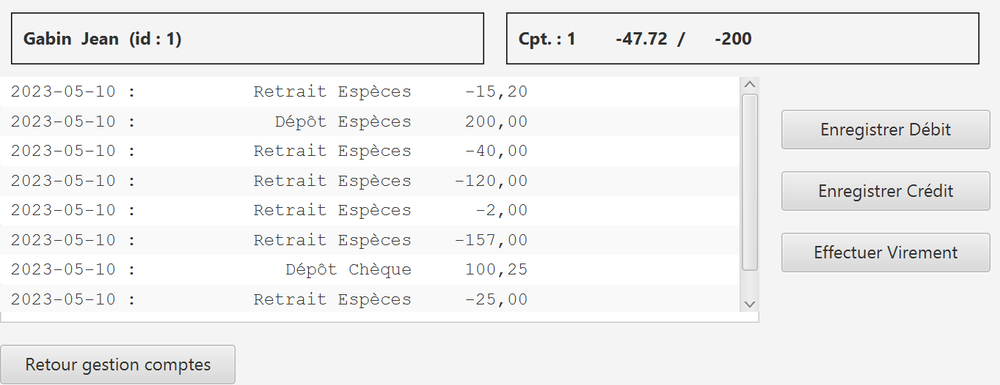

= Documentation utilisateur - BankUtil - Version 1
=
:toc-title: Sommaire
:toc: auto
:toclevels: 3

*Date :* 16/05/2023 +
*Par :* Équipe 4A3 : _DIDENKO Andrii, LAMOUR Evan, KRILL Maxence, SHULHINA Daria_

== I. Présentation

Bienvenue dans le guide utilisateur de l'application BankUtil à destination des employés de DailyBank.

Cette application est dedié aux ``Guichetiers`` et ``Chefs d'agence`` de la boite pour gérer *les employés, les clients, les comptes* des clients, les differentes *opérations* mais aussi la gestion des *prelevements* et que d'une *simulation d'emprunt* dédié aux ``chefs d'agence``.

Ce guide vous servira à connaître dans les détails les différentes fonctions de l'application.

== II. Installation

Pour lancer l'application veuillez cliquer sur ce lien : 

== III. Usages

===  1. Connexion | V0

Lors de l'ouverture de l'application, vous tomberez sur cette interface :

Appuyez sur le bouton ``Connexion`` ou sur ``Utilisateur > Connexion`` pour vous connecter à votre compte.

Renseignez ici votre identifiant et votre mot de passe pour accéder à votre compte :

=== 2. Page d'accueil | V0

Une fois connecté, vous arriverez sur cette fenêtre. Vous verrez les informations de votre agence, ainsi que les informations de l'utilisateur connecté.

image::../img/userDoc/accueil.png["Page d'accueil"]

=== 3. Déconnexion | VO

Depuis la page d'accueil, appuyez sur ``Deconnexion``, sinon, appuyez sur ``Deconnexion`` depuis le menu ``Utilisateur``.

=== 4. Gérer les clients | VO

Dans le menu, cliquez sur ``Gestion > Clients``.

Une fenêtre va s'ouvrir :

image::../img/userDoc/gererClient.png["Page de gestion client"]

Sur cette fenêtre, renseignez le Numéro du client cherché, son nom ou son prénom puis cliquez sur ``Rechercher``,
Si vous souhaiter afficher tout les clients, ne renseignez aucun champ et appuyez directement sur ``Rechercher``.

==== a. Créer un client | VO

Depuis l'écran de gestion de clients, cliquez sur ``Nouveau client``.

image::../img/userDoc/creerClient.png["Page de gestion client"]

Vous pouvez ici créer un nouveau client en saisissant ces données.

Cliquez sur ``Modifier`` pour valider ou sur ``Annuler`` pour revenir en arrière.

==== b. Modifier un client | VO

Depuis l'écran de gestion de clients, cliquez sur ``Modifier client``.

Vous pouvez ici changer les données d’un client. +
A noter que seul un chef d’agence peut modifier l’activité du client.

Cliquez sur ``Modifier`` pour valider ou sur ``Annuler`` pour revenir en arrière.

==== c. Rendre "inactif" un client | VO

Pour rendre "inactif" un client, assurez vous d'être connecté en tant que chef d’agence.

image::../img/userDoc/inactifClient.png["Page de suppresion client"]

Sélectionnez un client (assurez vous qu'il soit affiché en gris) puis cliquez  sur ``Désactiver client``.
*A noter que le solde des comptes du client doit être égal à 0*

=== 5. Gérer comptes bancaires

Depuis l'écran de gestion client, cliquez sur ``Comptes clients``.

Vous arrivez sur cet écran

image::../img/userDoc/gererCompte.png["Page de gestion comptes"]

==== a. Nouveau compte | E

Depuis l'écran précédent, cliquez sur ``Nouveau compte``.

Renseignez les informations du compte, puis cliquez sur ``Ajouter`` ou ``Annuler``.

==== b. Modifier un compte | M

==== c. Clotûrer compte | E

Sélectionnez un compte puis cliquez sur ``Supprimer`` pour clôturer le compte.

image::../img/userDoc/cloturerCompte.png["Erreur suppression compte"]

*A noter que le solde du compte doit être égal à 0*

=== 6. Gérer les opérations

Depuis la page de gestion des comptes, sélectionnez un compte et cliquez sur ``Voir opérations``.

A noter que l'interface de crédit et débit ont la même interface graphique. De ce fait, les procédures pour les deux opérations sont identiques.

==== a. Enregistrer opération | E

Vous avez la possibilité de choisir le type d'opération (crédit/débit) et d'indiquer le montant.

image::../img/userDoc/enregistrerOperation.png["Page d'enregistrement de débit/crédit"]

Une fois fait, cliquez sur ``Effectuer débit/crédit`` ou ``Annuler débit/crédit``.

==== b. Enregistrer virement | E

Dans l’onglet prélèvement, indiquez le numéro de compte destinataire ainsi que le montant de la transaction.

image::../img/userDoc/enregistrerVirement.png["Page de virement"]

==== c. Relevé PDF | A/D

=== 7. Gérer les employés | M

De la même manière que l’onglet de gestion des clients, vous pouvez gérer les employés en tant que chef d'agence.

image::../img/userDoc/gererEmploye.png["Page de gestion des employés"]

=== 8. Gérer les prélèment | E/M

De la même manière que l’onglet de gestion des clients, vous pouvez gérer les employés en tant que guichetier ou chef d'agence.

image::["Page de gestion des prélèvements"]

=== 9. Simuler un emprunt (Assurance) | E

Dans le menu, cliquez sur ``Simuler > Emprunt``.

Une fenêtre va s'ouvrir :

image::["Fenêtre de simulation d'emprunt"]

Rentrez dans les champs le montant du capital

Le taux choisis est celui ``Annuel``

Après avoir remplis les champs comme ceci par exemple

image::["Fenêtre de simulation d'emprunt complèté"]

Pour un taux d'assurance cliquer sur le bouton ``Assurance`` et rentrez votre taux dans la zone de texte.

Vous voulez ne plus avoir d'assurance, pas de problème recliquer sur le bouton ``Assurance``.

Validez, le tableau d'amortissement *avec* ou *sans* assurance apparaîtra

=== 9. Contact 

Si vous rencontrez des problème veuillez le signaler sur l'adresse mail assistanceDailyBank@gmail.com.

