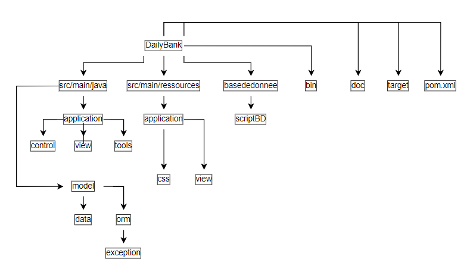

= Documentation technique - BankUtil - Version 1
:toc:
:toc-title: Sommaire

:Entreprise: DailyBank
:Equipe: 4A03

*Date :* 17/05/2023 +
*Par :* Équipe 4A3 : _DIDENKO Andrii, LAMOUR Evan, KRILL Maxence, SHULHINA Daria_ler chaques fonctionnalités de la V2 de l'application DailyBank

== I. Présentation de l'application

L’application Daily Bank est l’outil de gestion de la banque . Nous allons adapter cette application aux besoin de la banque pour developper les versions suivantes.

=== 1. Cas d'utilisation global

La V2 de l'application va permettre au ``guichetier`` de réaliser de nouvelles actions tel que :

* Générer un relevé mensuel d’un compte en PDF

* Gérer (faire le « CRUD[2] ») les prélèvements automatiques

Et pour les ``chefs d'agence`` :

* Effectuer un Débit exceptionnel

* Simuler un emprunt

* Simuler une assurance d’emprunt

image::../img/docTech/UCV2.png[]

=== 2. Diagramme de classe

Voici le diagramme de classe de la base de données de la banque DailyBank

image::../img/docTech/DCV2.png[]

* ``AgenceBancaire`` : represente une agence constitué du nom de l'agence, de son adresse, d'un id et d'un chef d'agence représenté par une ID.
* ``Employé`` : représente les employés de la banque, qui ont des login et des droits d'accès différents selon si ils sont chef d'agence ou pas .
* ``Client`` : représente le client avec toutes ses information personnelles ainsi que son agence et son statut (*Actif* ou *Innactif*) .
* ``CompteCourant`` : représente les comptes avec le numéro du compte, le debit autorisé, la solde, le numéro du client auquel appartient le compte , et son statut ( cloturé ou pas)
* ``Operation``: représente une operation opéré sur un compte, on y retrouve l'id de celle ci, le montant, la date , le numero du compte ainsi que le type d'opération.
* ``TypeOperation`` : liste les type d'OPERATION (Credit, Debit, Virement)
* ``PrelevementAutomatique`` : Représente une opération récurrente on y retrouve le *montant*, la *date récurrente* et le *bénéficiaire*
* ``Emprunt`` : représente une simulation d'un emprunt bancaire, est composé de taux emprunté, capital emprunté,
la durée de l'emprunt ainsi que la date de début de l'emprunt.
* ``Assurance``:représente un bonus de l'emprunt, et est composé d'un taux d'assurance et d'un taux couvrant 

== II. Architecture de l'application

=== 1. Schémas de l'architecture del'application

=== 2. Structuration des packages

Les packages : dans src/main/java

*** application

  ** DailyBank : main() de départ

*** application.control

  ** Contrôleurs de dialogue et accès aux données : gestion des fonctions de l’application. Deux rôles majeurs :

    * Réalise les actions concrètes : accès BD, faire un calcul complexe, générer un fichier, …

    * Ouvre les autres fenêtres nécessaires : gestion du dialogue.

*** application.view

   ** Contrôleurs associés aux vues fxml.

    * Gestion de la vue affichée : contrôle des saisies réalisées, messages d’erreurs pour les contrôles de surface, appel du contrôleur de dialogue pour réaliser les actions concrètes.

*** application.tools

  ** Utilitaires pour application.view et application.control

*** model.data

  ** Classes java mappant les table de la BD. Une table ⇒ 1 classe. On peut en ajouter (classes pour jointures, …)

*** model.orm

  ** Classes d’accès physiques à la BD. Une table ⇒ 1 classe offrant différentes méthodes pour accéder à la table : select, insert, delete, update, appel de procédure stockée (elles sont données). On peut en ajouter.

*** model.exception

  ** Classes des exceptions spécifiques d’accès à la BD, levées par les classes de model.orm

Les views fxml : dans src/main/resources.

*** application.view

  ** Vues de l’application : fichiers fxml

  ** Fichier css

=== 3. Rôle de chaque classes dans les packages

*** application

** DailyBank : main() de l’application, permet de lancer l'application ( "runapp()" ).

** DailyBankState : classe de description du contexte courant de l’application : qui est connecté ? est-il chef d’agence ? à quelle agence bancaire appartient-il ?

*** application.control

** Une classe par fenêtre dite contrôleur de dialogue. Exemple LoginDialog

** Rôles de chaque classe :

* A la création : i) construit le Stage java FX de la fenêtre, ii) charge le fichier fxml de la vue et son contrôleur

* Offre une méthode de démarrage du Dialogue, du type doNomClasseControlDialog(...). Exemple doLoginDialog()

* Offre des méthodes d’accès aux données, disponibles pour son contrôleur de vue

* Offre des méthodes d’activation d’autres fenêtres, disponibles pour son contrôleur de vue

* Peut offrir des méthodes de calcul ou autre (accès à des fichiers, …), disponibles pour son contrôleur de vue

*** application.view

** Une classe par fenêtre dite contrôleur de vue ET un fichier fxml associé. Exemple LoginDialogController et logindialog.fxml

** Un objet d’une telle classe ne connaît de l’application que son contrôleur de dialogue (de application.control)

** Rôles de chaque classe :

* Offre une méthode initContext(...) pour être initialisée. Appelée par le contrôleur de dialogue

* Offre une méthode displayDialog(...) pour afficher la fenêtre. Appelée par le contrôleur de dialogue

* Gère toutes les réactions aux interactions : saisies, boutons, …

* Met à jour l’interface lorsque de besoin : griser des boutons, remplir des champs, …

* Effectue tous les contrôles de surface au niveau de la saisie : valeurs remplies, nombres < 0, …

* Appelle son contrôleur de vue si besoin d’accéder à des données

* Appelle son contrôleur de vue si besoin de lancer une autre fonction (fenêtre) de l’application

*** model.data

** Classes java mappant les table de la BD.

* Une table ⇒ 1 classe. On peut en ajouter (classes pour jointures, …)

** Servent à échanger les donnes entre model.orm et application.control

** Ces classes ne définissent aucune méthode qui "fait quelque chose" (calcul, …). Les attributs sont public et une seule méthode toString (). Chaque attribut est un champ de la table.

** Ces classes ne contiennent que les champs de la BD que l’on souhaite remonter vers l’application.

*** model.orm

** Classes d’accès physiques à la BD.

** Une table ⇒ 1 classe offrant différentes méthodes pour accéder à la table : select, insert, delete, update, appel de procédure stockée (elles sont données). On peut en ajouter.

** Chaque classe : effectue une requête SQL, presque la requête qu’on ferait au clavier envoyée au serveur sous forme de String. Ensuite elle emballe le résultat en java (objets de model.data, ArrayList, …).

A part :

** model.exception : pour ne pas mélanger classes de code et classes d’exception

* A voir sur le code lorsque de besoin.

** application.tools : pour isoler des classes utilisées à plusieurs endroits et qui sont utilitaires par rapport aux objectifs de l’application.

*  A voir sur le code lorsque de besoin

== III. Installation et mise en place

=== 1. Installer l'application

Pour installer l'application rendez vous sur 

https://github.com/IUT-Blagnac/sae2023-bank-4a3/tree/master/LV2/Dev/Code/DailyBank

Il vous faut un workspace supportant java FX 

Lancer Eclipse sur ce workspace

Importer le projet

File → Import…​ → Général → Existing Projetcs into Workspace → Puis ouvrir le projet

Corriger éventuellement le JDK (Properties → Java Build Path)

Project → Properties → Java Build Path → onglet "Libraries"

Enlever le jre/jdk "en rouge" qui pose problème (le sélectionner puis Remove)

Add Library → JRE System Library →

Choisir un jdk 17.

Penser à faire sur le projet : Maven > Update Project …​

=== 2. Configurer l'application et BD

Connectez vous à votre base depuis sqldeveloper avec les information de ce compte.

Infos pour créer la connexion sqlserver à Oracle :

Hôte Oracle : ``oracle.iut-blagnac.fr``

Port : ``1521``

Nom d’instance de bases de données : ``db11g``

Identifiant : ``G4A3S2``

Mdp : ``SAEDAME``

Vous avez dans le code ci dessous la connection entre la BD et le java

Si vous voulez changer de BD changer les informations dans cette page.

image::../img/docTech/AssociationBD.png["Image association bd"]

=== 3. Lancer le projet

Pour lancer le projet allez sur Eclipse 
Puis Clique droit sur le projet > Run As > 3 Maven Build.

Goals : ``clean javafx:run``

Apply > Run.

== IV. Fonctionnalités de l'application

=== 1. Créer un client Evan

==== A. Use Case

image::../img/docTech/UC-C-Client.png["Use case créer un client"]

Création de la fonctionalité créer un compte disponible pour les guichetiers et les chefs d'agence

==== B. Diagramme de classe

La classe utilisé est Client, est elle modifié.

image::../img/docTech/DC-Client.png["DC créer client"]

==== C. Classes impliquées créer client

image::../img/docTech/DS-Create_Client.png["DS créer client"]

=== 2. Modifier un client Evan

==== A. Use Case

image::../img/docTech/US-updateC.png[Use case Modifier un client]

Création de la fonctionalité modifier un compte disponible pour les guichetiers et les chefs d'agence

==== B. Diagramme de classe

La classe utilisé est client, elle est utilisé en tant que lecture ainsi que en modification

image::../img/docTech/DC-Client.png["DC Client"]

==== C. Classes impliquées modifier client

image::../img/docTech/DS-Update_Client.png[DS modifier client]

=== 3. Clotûrer client Maxence

=== 4. Consulter un compte Evan

==== A. Use Case

Création de la fonctionalité consulter un compte disponible pour les guichetiers et les chefs d'agence

image::../img/docTech/UC-ConsulterCompte.png["Use case consulter un compte]

==== B. Diagramme de classe

Les deux classe utilisé dans la base de donnée sont Client et CompteCourant , les deux classes sont en lectures.

image::../img/docTech/DC_create_compte.png[]
image::../img/docTech/DC_create_client.png[]

==== C. Classes impliquées...

image::["DS Consulter un compte"]

=== 5. Créer compte Evan

==== A. Use Case

image::../img/docTech/UC-C-Compte.png[]

Création de la fonctionnalité créer compte pour les guichetier et les chefs d’agence

==== B. Diagramme de classe

Les deux classe utilisé dans la base de donnée sont Client et CompteCourant , Client est utilisé en tant que lecture, CompteCourant est modifié.

image::../img/docTech/DC_create_compte.png[]
image::../img/docTech/DC_create_client.png[]

==== C. Classes impliquées créer compte

=== 5. Modifier un compte Maxence

==== A. Use Case

==== B. Diagramme de classe

==== C. Classes impliquées...

=== 6. Clotûrer un compte Evan

==== A. Use Case

Création de la fonctionnalité clotûrer compte pour les guichetiers et les chefs d’agence

image::../img/docTech/UC-D-Compte.png["Use case clotûrer compte]

==== B. Diagramme de classe

Les deux classe utilisé dans la base de donnée sont Client et CompteCourant , Client est utilisé en tant que lecture, CompteCourant est modifié.

image::../img/docTech/DC_create_compte.png[]
image::../img/docTech/DC_create_client.png[]

==== C. Classes impliquées...

=== 7.  Effectuer Crédit Evan

==== A. Use Case

Création de la fonctionnalité créditer compte pour les guichetiers et les chefs d’agence

image::../img/docTech/UC-Credit.png["Use Case Créditer]

==== B. Diagramme de classe

Les classes utilisées sont TypeOpération(Lecture), Opération(Modification) et CompteCourant(Modification)

image::../img/docTech/DC-Operation.png["DC operation"]

==== C. Classes impliquées...

image::../img/docTech/DS-credit.png["DS créditer"]

=== 8. Effectuer Débit Evan

==== A. Use Case

Création de la fonctionnalité debiter compte pour les guichetiers et les chefs d’agence

image::../img/docTech/UC-Debit.png["Use Case Débiter]

==== B. Diagramme de classe

Les classes utilisées sont TypeOpération(Lecture), Opération(Modification) et CompteCourant(Modification)

image::../img/docTech/DC-Operation.png["DC operation"]

==== C. Classes impliquées...

image::../img/docTech/DS-DEBIT.png["DS Débiter"]

=== 9. Effectuer Virement Evan

==== A. Use Case

Création de la fonctionnalité virement pour les guichetiers et les chefs d’agence

image::../img/docTech/UC-Virement.png["Use Case virement]

==== B. Diagramme de classe

Les classes utilisées sont TypeOpération(Lecture), Opération(Modification) et CompteCourant(Modification)

image::../img/docTech/DC-Operation.png["DC operation"]

==== C. Classes impliquées...

=== 10. Génerer PDF Andrei/Daria

==== A. Use Case

==== B. Diagramme de classe

==== C. Classes impliquées...

=== 11. Créer Prélèvement Evan

==== A. Use Case

Création de la fonctionnalité créer prélèvement pour les guichetiers et les chefs d’agence.

image::../img/docTech/UC-prelevement.png["UC prelevement"]

==== B. Diagramme de classe

Les classes utilisées sont PrélèvementAutomatique (Modification) et CompteCourant (Lecture)

image::../img/docTech/DC-prelevement.png["DC Prélèvement"]

==== C. Classes impliquées...

=== 12. Modifier Prélèvement Maxence

==== A. Use Case

==== B. Diagramme de classe

==== C. Classes impliquées...

=== 13. Supprimer Prélèvement Maxence

==== A. Use Case

==== B. Diagramme de classe

==== C. Classes impliquées...

=== 14. Créer Employés Andrei/Daria

==== A. Use Case

==== B. Diagramme de classe

==== C. Classes impliquées...

image::../img/docTech/DS-C-Employe.png["DS créer employé"]

=== 15. Modifier Employés Maxence

==== A. Use Case

==== B. Diagramme de classe

==== C. Classes impliquées...

=== 16. Supprimer Employés Andrei/Daria

==== A. Use Case

==== B. Diagramme de classe

==== C. Classes impliquées...

image::../img/docTech/DS-D-Employe.png["DS supprimer employé"]

=== 17. Effectuer un débit exceptionnel Maxence

==== A. Use Case

==== B. Diagramme de classe

==== C. Classes impliquées...

=== 18. Simuler un emprunt Evan

==== A. Use Case

Création de la fonctionnalité Emprunt uniquement pour les chefs d’agence

image::../img/docTech/UC-SimuE.png["UC simulation emprunt"]

==== C. Classes impliquées...

image::../img/docTech/DS-Emprunt-Assurance.png["DS-Emprunt"]

=== 19. Simuler une assurance Evan

==== A. Use Case

Création de la fonctionnalité Assurance uniquement pour les chefs d’agence

image::../img/docTech/UC-SimuA.png["UC simulation Assurance"]

==== C. Classes impliquées...

image::../img/docTech/DS-Emprunt-Assurance.png["DS- Assurance"]
