= Documentation technique - BankUtil - Version 2
:toc:
:toc-title: Sommaire
:toclevels: 4

:Entreprise: DailyBank
:Equipe: 4A03

*Date :* 28/05/2023 +
*Par :* Équipe 4A3 : _DIDENKO Andrii, LAMOUR Evan, KRILL Maxence, SHULHINA Daria_

== I. Présentation

=== 1. Contexte

Pour s’adapter aux exigences d’instantanéité de leurs clients, les banques françaises ont accentué leurs efforts de restructuration et leurs investissements dans le digital. Par exemple, la Banque Postale a annoncé que sa banque mobile baptisée Ma French Bank sera disponible dans les bureaux de Poste au printemps 2019. Mais les banques ne se contentent pas de créer des offres alternatives : elles rénovent aussi en profondeur leurs services de banque au quotidien.

Les banques de détail investissent dans la modernisation des outils de bureautique et la robotisation pour automatiser les tâches. BNP Paribas révolutionne son modèle hiérarchique vers une approche transversale basée sur des parcours clients. Des professionnels de différentes disciplines collaborent pour développer les parcours de chaque client en temps réel, nécessitant des changements culturels et organisationnels ainsi qu'une nouvelle architecture IT.

=== 2. Objectifs

La banque DailyBank souhaite donc actualiser son application Java BankUtil, devenue obselète, afin de la déployer dans son réseau de 100 agences dans le cadre du plan de restructuration.
Elle devra permettre de gérer totalement les comptes des clients (créditer, débiter, virement, ouvrir, clotûrer, ...) et d'autres fonctionnalitées telles que la gestion des employés par le chef d'agence.

L’application Daily Bank est l’outil de gestion de la banque . Nous allons adapter cette application aux besoin de la banque pour developper les versions suivantes.

=== 3. Cas d'utilisation global

La V2 de l'application va permettre au *guichetier* de réaliser de nouvelles actions telles que :

* Générer un relevé mensuel d’un compte en PDF
* Créer/Consulter/Modifier/Supprimer des prélèvements automatiques

Le *Chef d'Agence* quant à lui aura la possibilité de réaliser toutes les actions d'un guichetier et pourra désormais :

* Effectuer un débit exceptionnel
* Simuler un emprunt
* Simuler une assurance d’emprunt

image::../img/uc-initialv2.svg[]

=== 4. Diagramme de classe

Voici le diagramme de classe de la base de données de la banque DailyBank

image::../img/dc-initialv2.png[]

* `AgenceBancaire` : Représente une agence avec son nom, son adresse, son identifiant unique et un chef d'agence représenté par son identifiant.

* `Employé` : Représente les employés de la banque grâce à leur identifiant (login), leur mot de passe, leurs informations personnelles (nom, prénom) et leurs droits d'accès (selon leur poste : chef d'agence ou guichetier).

* `Client` : Représente le client avec toutes ces informations personnelles, son agence et son statut (actif ou inactif).

* `CompteCourant` : Représente les comptes des clients avec leur numéro, leur découvert maximal autorisé, leur solde, le numéro de leur propriétaire et son statut (clôturé ou ouvert).

* `Operation`: Représente une opération opérée sur un compte. On y retrouve l'identifiant de cette dernière, le montant, la date, le numero du compte iniateur ainsi que le type d'opération (cf `TypeOperation`).

* `TypeOperation` : Liste les type d' `Operation` (Credit, Debit, Virement).{allow-uri-read}
* `PrelevementAutomatique` : Représente une opération récurrente on y retrouve le compte débiteur, son montant, sa date de récurrence et son bénéficiaire.

* `Emprunt` : Représente une simulation d'un emprunt bancaire, composée d'un taux d'emprunt, d'un capital emprunté, d'une durée d'emprunt ainsi que sa date de début.
* `Assurance` : Représente un bonus de l' `Emprunt`. Elle est composée d'un taux d'assurance et d'un taux couvrant.

== II. Architecture de l'application

=== 1. Schémas de l'architecture del'application

image::../img/docTech/ArchiCode.png["Architecture de l'application"]

=== 2. Structuration des packages

Les packages : dans `src/main/java`

* `application`

  ** `DailyBank` : `main()` de départ

* `application.control`

  ** Contrôleurs de dialogue et accès aux données : gestion des fonctions de l’application. Deux rôles majeurs :

    *** Réalise les actions concrètes : accès base de données, faire un calcul complexe, générer un fichier, …

    *** Ouvre les autres fenêtres nécessaires : gestion du dialogue.

* `application.view`

   ** Contrôleurs associés aux vues FXML.

    *** Gestion de la vue affichée : contrôle des saisies réalisées, messages d’erreurs pour les contrôles de surface, appel du contrôleur de dialogue pour réaliser les actions concrètes.

* `application.tools`

  ** Utilitaires pour `application.view` et `application.control`

* `model.data`

  ** Classes Java mappant les table de la base de données. Une table ⇒ 1 classe. On peut en ajouter (classes pour jointures, …)

* `model.orm`

  ** Classes d’accès physiques à la base de données. Une table ⇒ 1 classe offrant différentes méthodes pour accéder à la table : select, insert, delete, update, appel de procédure stockée (elles sont données). On peut en ajouter.

* `model.exception`

  ** Classes des exceptions spécifiques d’accès à la base de données, levées par les classes de model.orm

Les views FXML : dans `src/main/resources`

* `application.view`

  ** Vues de l’application : fichiers FXML

  ** Fichier CSS

=== 3. Rôle de chaque classes dans les packages

* `application`

  ** `DailyBank` : `main()` de l’application, permet de lancer l'application (`runapp()`)

  ** `DailyBankState` : Classe de description du contexte courant de l’application : Qui est connecté ? Est-il chef d’agence ? A quelle agence bancaire appartient-il ?

* `application.control`

  ** Une classe par fenêtre dite contrôleur de dialogue. Exemple : `LoginDialog`

  ** Rôles de chaque classe :

    *** A la création :
    
    **** Construit le Stage Java FX de la fenêtre
    
    **** Charge le fichier FXML de la vue et son contrôleur

    *** Offre une méthode de démarrage du Dialogue, du type `doNomClasseControlDialog`(...). Exemple : `doLoginDialog()`

    *** Offre des méthodes d’accès aux données, disponibles pour son contrôleur de vue

    *** Offre des méthodes d’activation d’autres fenêtres, disponibles pour son contrôleur de vue

    *** Peut offrir des méthodes de calcul ou autre (accès à des fichiers, …), disponibles pour son contrôleur de vue

* `application.view`

  ** Une classe par fenêtre dite contrôleur de vue ET un fichier FXML associé. Exemple : `LoginDialogController` et `logindialog.FXML`

  ** Un objet d’une telle classe ne connaît de l’application que son contrôleur de dialogue (de `application.control`)

  ** Rôles de chaque classe :

    *** Offre une méthode `initContext(...)` pour être initialisée. Appelée par le contrôleur de dialogue

    *** Offre une méthode `displayDialog(...)` pour afficher la fenêtre. Appelée par le contrôleur de dialogue

    *** Gère toutes les réactions aux interactions : saisies, boutons, …

    *** Met à jour l’interface lorsque de besoin : griser des boutons, remplir des champs, …

    *** Effectue tous les contrôles de surface au niveau de la saisie : valeurs remplies, nombres < 0, …

    *** Appelle son contrôleur de vue si besoin d’accéder à des données

    *** Appelle son contrôleur de vue si besoin de lancer une autre fonction (fenêtre) de l’application

* `model.data`

  ** Classes java mappant les tables de la base de données.

    *** Une table ⇒ 1 classe. On peut en ajouter (classes pour jointures, …)

  ** Servent à échanger les donnes entre `model.orm` et `application.control`

  ** Ces classes ne définissent aucune méthode qui "fait quelque chose" (calcul, …). Les attributs sont public et une seule méthode `toString()`. Chaque attribut est un champ de la table.

  ** Ces classes ne contiennent que les champs de la base de données que l’on souhaite remonter vers l’application.

* `model.orm`

  ** Classes d’accès physiques à la base de données.

  ** Une table ⇒ 1 classe offrant différentes méthodes pour accéder à la table : select, insert, delete, update, appel de procédure stockée (elles sont données). On peut en ajouter.

  ** Chaque classe : Effectue une requête SQL, presque la requête qu’on ferait au clavier envoyée au serveur sous forme de `String`. Ensuite elle emballe le résultat en Java (objets de `model.data`, `ArrayList`, …), mise à part certaines classes :

  *** `model.exception` : Pour ne pas mélanger classes de code et classes d’exception

  **** A voir sur le code lorsque l'on a besoin.

  ** `application.tools` : Pour isoler des classes utilisées à plusieurs endroits et qui sont utilitaires par rapport aux objectifs de l’application.

    *** A voir sur le code lorsque l'on a besoin.

== III. Installation et mise en place

=== 1. Configurer la base de données

Connectez vous à votre base depuis Oracle SQL Developer avec les information de ce compte :

* Hôte Oracle : `oracle.iut-blagnac.fr`

* Port : `1521`

* Nom d’instance de bases de données : `db11g`

* Identifiant : `G4A3S2`

* Mot de passe : `SAEDAME`

Vous avez dans le code ci-dessus la connection entre la base de données et le programme Java.

Si vous voulez changer de base de données changer les informations dans cette page.

=== 2. Installer l'application

==== A Installer l'application grâce au `.jar`

Pour installer l'application facilement à l'aide du `.jar` rendez-vous sur https://github.com/IUT-Blagnac/sae2023-bank-4a3/releases/tag/v1 puis télécharger le fichier `4A3-DailyBank-V2.jar`.

Exécutez-le, l'application s'ouvre.

==== B Installer l'application depuis Eclipse

Pour installer l'application depuis Eclipse, rendez-vous sur https://github.com/IUT-Blagnac/sae2023-bank-4a3/tree/master/LV2/Dev/Code/DailyBank.

Lancer Eclipse sur un workspace JavaFX :

* Importer le projet

* `File` → `Import` …` → `Général` → `Existing Projetcs into Workspace` → Puis ouvrir le projet

* Corriger éventuellement le JDK (`Properties` → `Java Build Path`)

* `Project` → `Properties` → `Java Build Path` → onglet "`Libraries`"

* Enlever le JRE/JDK "en rouge" qui pose problème (le sélectionner puis `Remove`)

* `Add Library` → `JRE System Library` → Choisir un JDK 17.

Penser à mettre à jour Maven sur le projet : `Maven` > `Update Project` …​

Pour lancer le projet allez sur Eclipse

Clique droit sur le projet > `Run As` > `3... Maven Build` > `Goals` : `clean install javafx:run` > `Apply` > `Run`

== IV. Fonctionnalités de l'application

=== 1. Créer un client - Evan

==== A. Use Case

Création de la fonctionalité `Créer un client` disponible pour les guichetiers et les chefs d'agence.

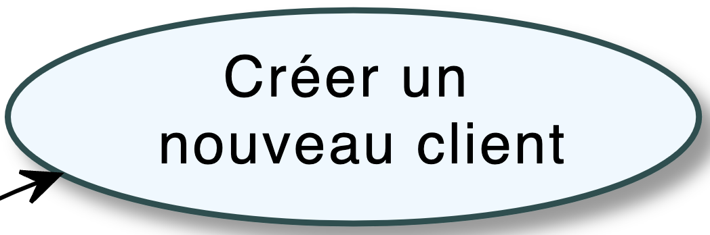

==== B. Diagramme de classe

La classe utilisée est `Client`, elle est elle modifiée.

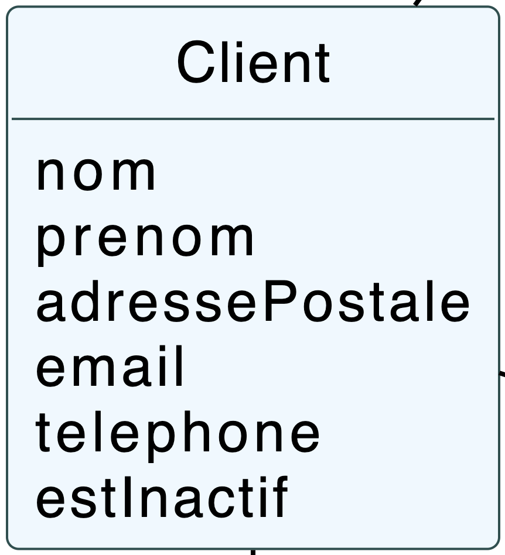

==== C. Classes impliquées

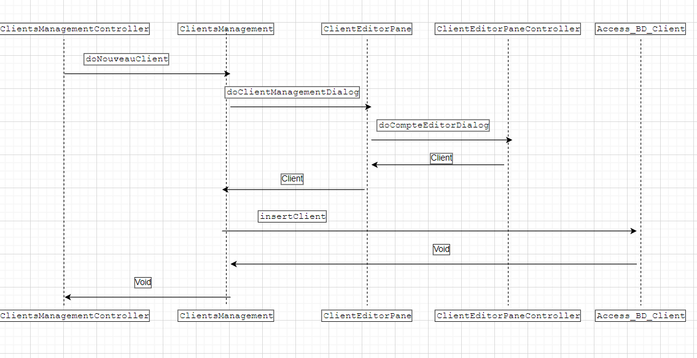

=== 2. Modifier un client - Evan

==== A. Use Case

Création de la fonctionalité `Modifier un client` disponible pour les guichetiers et les chefs d'agence.

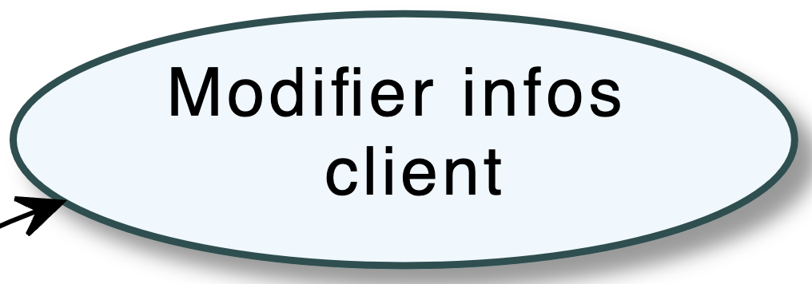

==== B. Diagramme de classe

La classe utilisée est `Client`, en lecture ainsi qu'en modification.

==== C. Classes impliquées

=== 3. Rendre inactif un client - Maxence

==== A. Use Case

Création de la fonctionnalité `Rendre inactif un client` disponible pour les chefs d'agence.

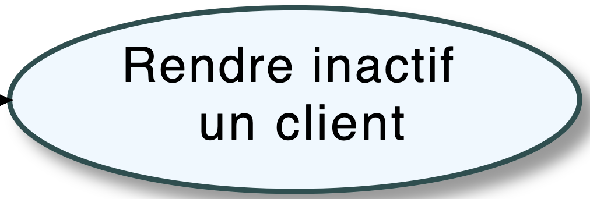

==== B. Diagramme de classe

Les classes utilisées sont `Client` en lecture et en modification ainsi que `CompteCourant` en lecture uniquement.

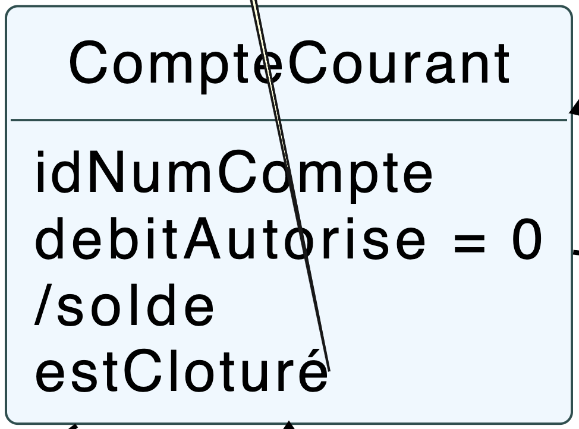

==== C. Classes impliquées

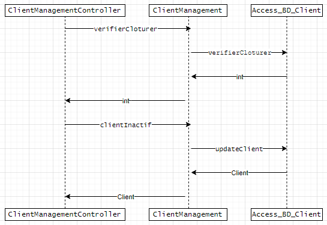

=== 4. Consulter les comptes d'un client - Evan

==== A. Use Case

Création de la fonctionalité `Consulter les comptes d'un client` disponible pour les guichetiers et les chefs d'agence.

==== B. Diagramme de classe

Les deux classes utilisées sont `Client` et `CompteCourant`, les deux classes sont en consultation.

==== C. Classes impliquées

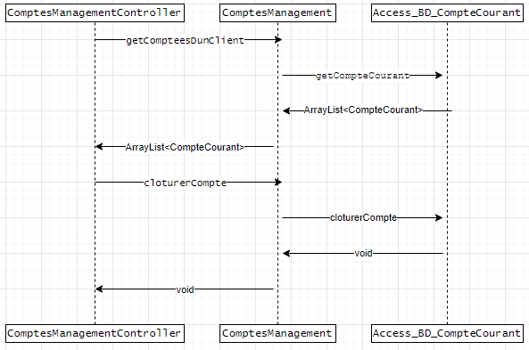

=== 5. Créer un compte - Evan

==== A. Use Case

Création de la fonctionnalité `Créer un compte` pour les guichetier et les chefs d’agence.

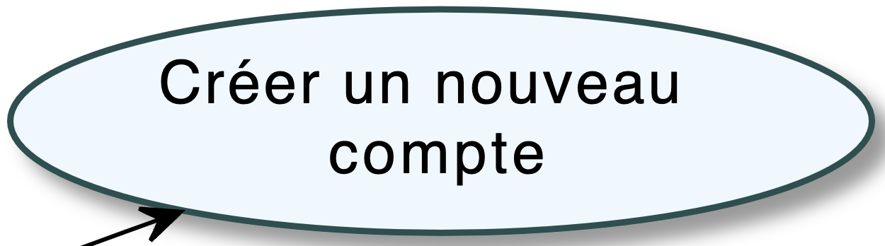

==== B. Diagramme de classe

Les deux classes utilisées sont `Client` et `CompteCourant`. `Client` est utilisée en lecture, `CompteCourant` est elle modifiée.

==== C. Classes impliquées

image::../img/docTech/DS/C_Compte.png["DS - Créer un compte"]

=== 6. Clotûrer un compte - Maxence

==== A. Use Case

Création de la fonctionnalité `Clotûrer un compte` pour les guichetiers et les chefs d’agence.

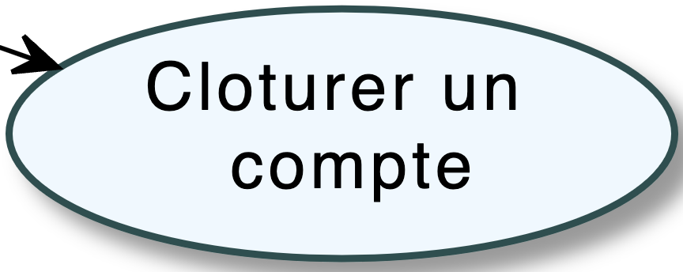

==== B. Diagramme de classe

Les deux classes utilisées sont `Client` et `CompteCourant`. `Client` est utilisée en lecture, `CompteCourant` est modifiée.

==== C. Classes impliquées

image::../img/docTech/DS/D_Compte.png["DS - Clotûrer un compte"]

=== 7. Effectuer un crédit - Evan

==== A. Use Case

Création de la fonctionnalité `Créditer un compte` pour les guichetiers et les chefs d’agence.

==== B. Diagramme de classe

Les classes utilisées sont `TypeOperation` (Lecture), `Operation` (Modification) et `CompteCourant` (Modification)

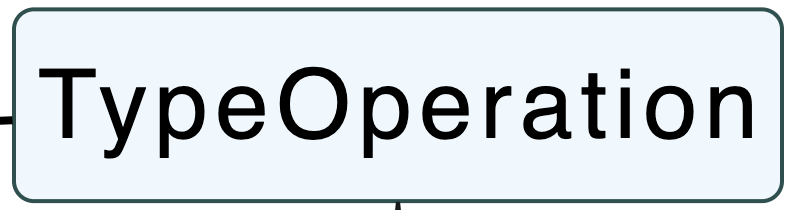

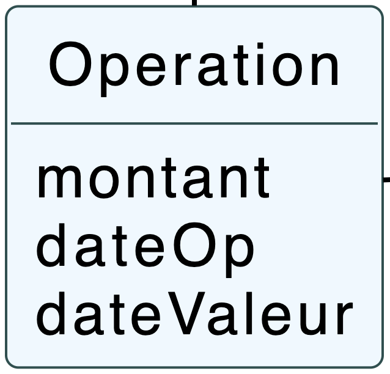

==== C. Classes impliquées

=== 8. Effectuer un débit - Evan

==== A. Use Case

Création de la fonctionnalité `Débiter un compte` pour les guichetiers et les chefs d’agence.

==== B. Diagramme de classe

Les classes utilisées sont `TypeOperation` (Lecture), `Operation` (Modification) et `CompteCourant` (Modification).

==== C. Classes impliquées

=== 9. Effectuer un virement - Evan

==== A. Use Case

Création de la fonctionnalité `Virement de compte à compte` pour les guichetiers et les chefs d’agence.

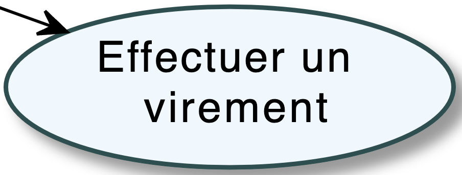

==== B. Diagramme de classe

Les classes utilisées sont `TypeOperation` (Lecture), `Operation` (Modification) et `CompteCourant` (Modification).

==== C. Classes impliquées

image::../img/docTech/DS/Virement_Compte.png["DS - Virement"]

=== 10. Génerer PDF - Andrii et Daria

==== A. Use Case

Création de la fonctionnalité `Relevé PDF` pour les guichetiers et les chefs d’agence.

==== B. Diagramme de classe

Les classes utilisées sont `CompteCourant` et `Operation` en lecture uniquement.

==== C. Classes impliquées

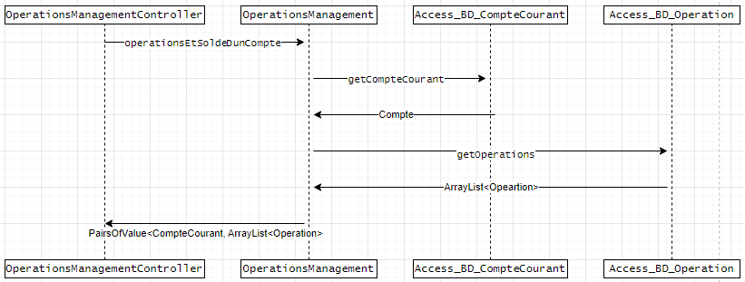

=== 11. Consulter les prélèvements automatiques - Evan

==== A. Use Case

Création de la fonctionnalité `Consulter les prélèvements automatiques` pour les guichetiers et les chefs d’agence.

==== B. Diagramme de classe

Les classes utilisées sont `PrelevementAutomatique` en lecture uniquement.

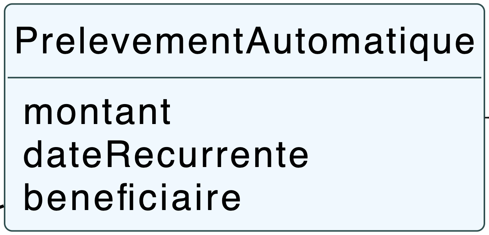

==== C. Classes impliquées

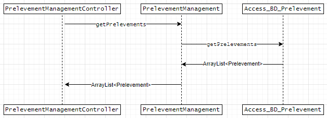

=== 12. Créer un prélèvement automatique - Evan

==== A. Use Case

Création de la fonctionnalité `Créer un prélèvement automatique` pour les guichetiers et les chefs d’agence.

==== B. Diagramme de classe

Les classes utilisées sont `PrelevementAutomatique` (Modification) et `CompteCourant` (Lecture).

==== C. Classes impliquées

image::../img/docTech/DS/C_Prelevement.png["DS - Créer un prélèvement automatique"]

=== 13. Modifier un prélèvement automatique - Maxence

==== A. Use Case

Création de la fonctionnalité `Modifier un prélèvement automatique` pour les guichetiers et les chefs d’agence.

==== B. Diagramme de classe

La classe utilisée est `PrelevementAutomatique` (Modification).

==== C. Classes impliquées

image::../img/docTech/DS/U_Prelevement.png["DS - Modifier un prélèvement automatique"]

=== 14. Supprimer un prélèvement automatique - Maxence

==== A. Use Case

Création de la fonctionnalité `Supprimer un prélèvement automatique` pour les guichetiers et les chefs d’agence.

==== B. Diagramme de classe

La classe utilisée est `PrelevementAutomatique` (Modification).

==== C. Classes impliquées

image::../img/docTech/DS/D_Prelevement.png["DS - Supprimer un prélèvement automatique"]

=== 15. Consulter les employés de l'agence - Maxence

==== A. Use Case

Création de la fonctionnalité `Créer un employé` pour les chefs d’agence.

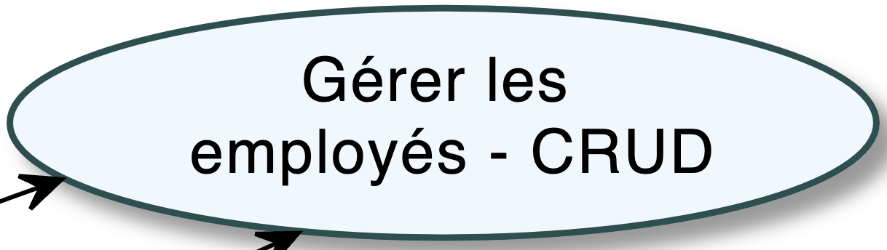

==== B. Diagramme de classe

La classe utilisée est `Employe` (Lecture).

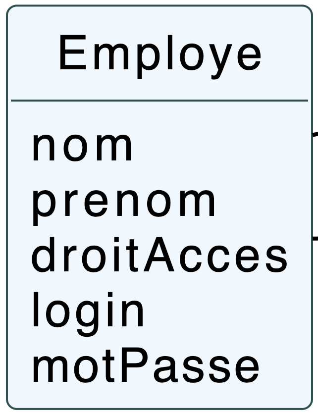

==== C. Classes impliquées

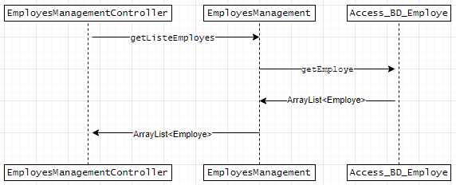

=== 16. Créer un employé - Andrii et Daria

==== A. Use Case

Création de la fonctionnalité `Créer un employé` pour les chefs d’agence.

==== B. Diagramme de classe

La classe utilisée est `Employe` (Modification).

==== C. Classes impliquées

=== 17. Modifier un employé - Maxence

==== A. Use Case

Création de la fonctionnalité `Modifier un employé` pour les chefs d’agence.

==== B. Diagramme de classe

La classe utilisée est `Employe` (Modification).

==== C. Classes impliquées

image::../img/docTech/DS/U_Employe.png["DS - Modifier un employé"]

=== 18. Supprimer un employé - Andrii et Daria

==== A. Use Case

Création de la fonctionnalité `Supprimer un employé` pour les chefs d’agence.

==== B. Diagramme de classe

La classe utilisée est `Employe` (Modification).

==== C. Classes impliquées

=== 19. Effectuer un débit exceptionnel - Maxence

==== A. Use Case

Création de la fonctionnalité `Débit exceptionnel d'un compte` pour les chefs d’agence.

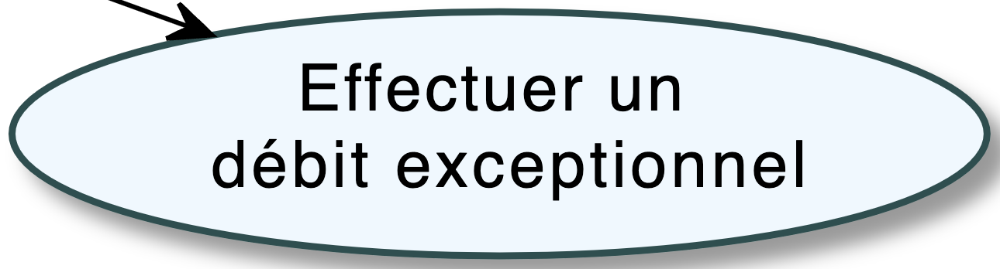

==== B. Diagramme de classe

Les classes utilisées sont `TypeOperation` (Lecture), `Operation` (Modification) et `CompteCourant` (Modification).

==== C. Classes impliquées

image::../img/docTech/DS/Debit_Compte.png["DS - Débit exceptionnel d'un compte"]

=== 20. Simuler un emprunt - Evan

==== A. Use Case

Création de la fonctionnalité `Emprunt` uniquement pour les chefs d’agence.

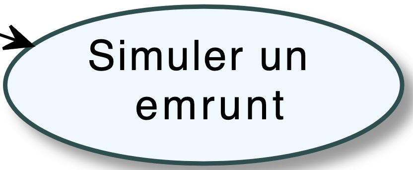

==== B. Diagramme de classe

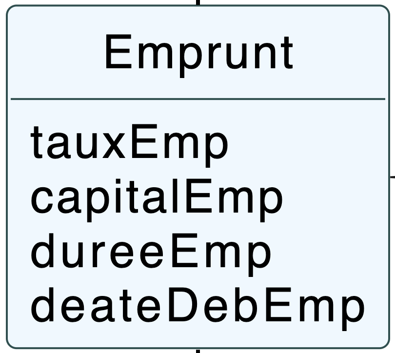

==== C. Classes impliquées

=== 21. Simuler une assurance - Evan

==== A. Use Case

Création de la fonctionnalité `Assurance` uniquement pour les chefs d’agence.

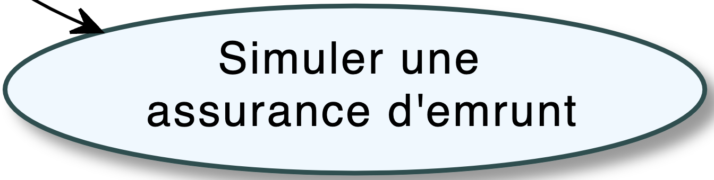

==== B. Diagramme de classe

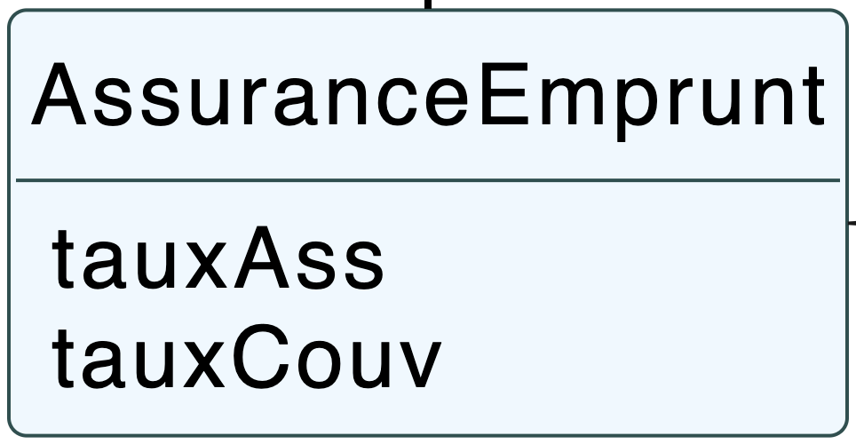

==== C. Classes impliquées

